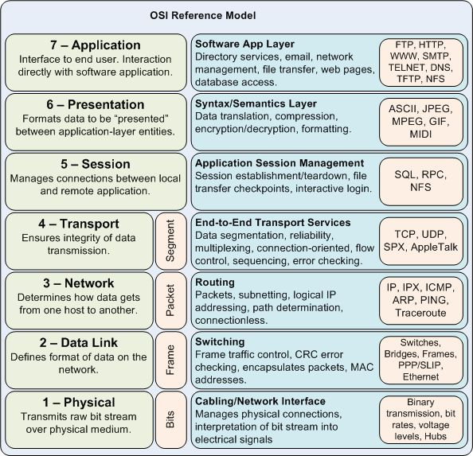
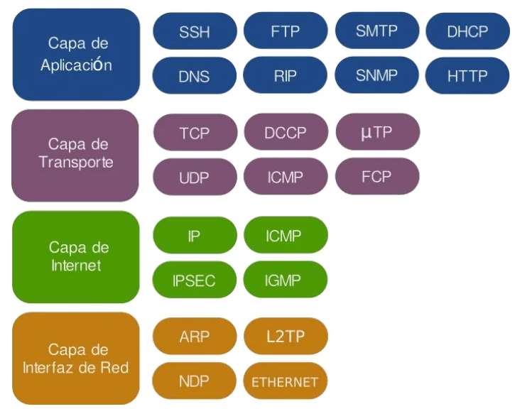
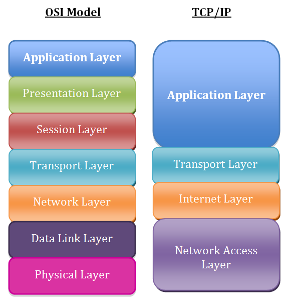
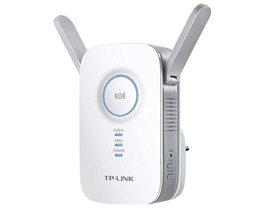
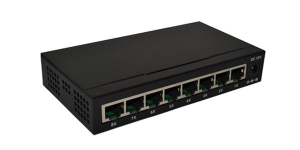
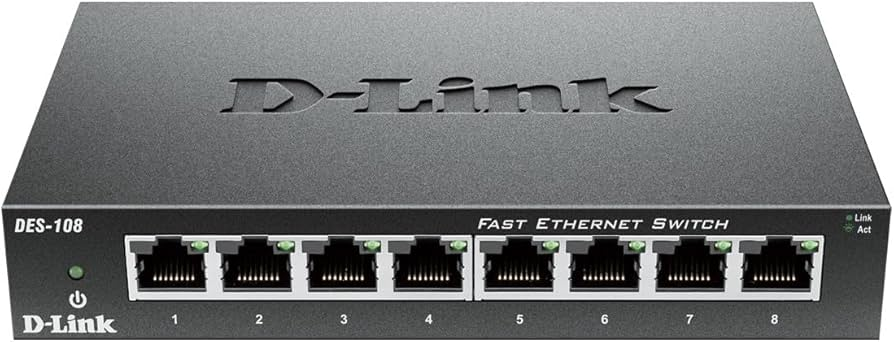
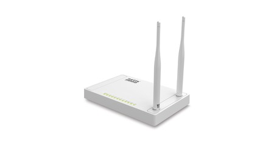
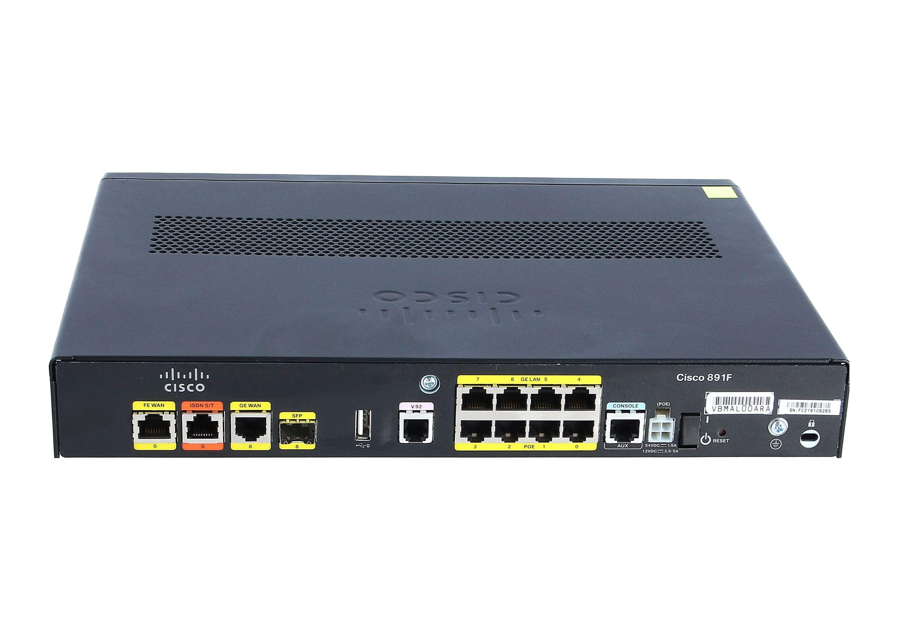

# Unidad 2 - Normalización de las redes

## Arquitecturas de redes en capas

La arquitectura de red por capas es un enfoque estructurado para el diseño de redes de comunicaciones que organiza la funciones de red en varias capas, donde cada capa tiene una tarea específica y se comunica con las capas adyacentes. Este modelo permite simplificar el diseño, desarrollo y mantenimimento de las redes, además de facilitar la interoperabilidad entre diferentes tecnologías y proveedores.

El desarrollo de las redes de comunicaciones trajo consigo el desafío de conectar dispositivos de diferentes fabricantes y tecnologías. Para que todos estos estándares puedan comunicarse eficazmente, fue necesario crear estándares comunes que definieran cómo deben intercambiarse los datos.

El uso de estos estándares favorece los siguientes conceptos:

* Interoperabilidad: permite que los dispositivos y sistemas de distintos fabricantes se comuniquen sin problemas.
* Modularidad: cada capa se encarga de una función específica, permitiendo actualizar o modificar partes de la red sin afectar a todo el sistema.
* Facilidad de diagnóstico: la estructura por capas facilita la localización y resolución de problemas, ya que es posible identificar en qué capa ocurre el fallo.
* Escalabilidad: permite diseñar redes que crecen y se adaptan a nuevas necesidades sin necesidad de rediseñar todo el sistema.

La arquitectura de una red es el conjunto organizado de capas y protocolos en cada capa. Esta organización de la red debe estar suficientemente clara como para que los fabricantes de software o hardware puedan diseñar sus productos con la garantía de que funcionarán en comunicación con otros equipos que sigan las mismas reglas.

Un protocolo en una red de comunicación es un conjunto de reglas y normas que definen cómo se debe realizar la comunicación entre dispositivos en una red. Estas reglas especifican el formato, la sincronización, la secuencia y el control de errores en la transmisión de datos, asegurando que los dispositivos puedan entenderse y colaborar de manera eficiente y coherente.

Dentro de cada nivel de una arquitectura por capas coexisten distintos servicios. En una jerarquiía de capas se siguen las siguientes reglas:

* Cada nivel dispone de un conjunto de servicios, los cuales se definen mediente protocolos estándar.
* Cada nivel se comunica solamente con el nivel inmediato superior y con el inmediato inferior.
* Cada nivel proporciona servicios al nivel immediato superior.

Cuando se comunican dos dispositos que utilizan la misma arquitectura de red, los protocolos que se encuentra en el mismo nivel deben coordinar el proceso de comunicación, es decir, deben ponerse de acuerdo y utilizar las mismas reglas de transmisión, o dicho de otro modo, deben usar el mismo protocolo.

### Encapsulación

En el modelo de arquitectura por niveles, al transmitir información es necesario añadir datos adicionales para que los procesos equivalentes puedan comunicarse en un nivel específico. Estos datos adicionales varían según el protocolo epleado y su significado solo es relevante en ese nivel, los niveles inferiores los tratan simplemente como datos a transmitir.

Este añadido se denomina habitualmente cabecera o información de control, y suele situarse al principio y/o final del mensaje. El proceso de agregar esta cabecera se conoce comúnmente como encapsulación.

La estructura que toma un conjunto de datos en cualquier capa se denomina unidad de datos de protocolo (PDU - Protocol Data Unit). Durante la comunicación, cada capa encapsula las PDU que recibe de la capa superior de acuerdo con el protocolo correspondiente.

En cada fase del proceso, una PDU recibe un nombre diferente para reflejar su estructura. Aunque no existe una conveción de nombres universal para las PDU, en el modelo de arquitectura de red de Internet se les denomina de la siguiente manera:

* **Datos**: Término general para las PDU que se manejan en la capa de aplicación.
* **Segmento**: PDU de la capa de transporte.
* **Paquete**: PDU de la capa de red.
* **Trama**: PDU de la capa de enlace.
* **Bits**: PDU que se utiliza para transmitir físicamente los datos a través de un medio.

{ width="750" }

En todas las capas de una arquitectura de red se añaden cabeceras de control para facilitar la comunicación, y estas cabeceras varían según el protocolo utilizado en cada nivel. Por ejemplo, en una arquitectura de siete capas se añaden seis cabceras de control al mensaje original durante la transmisión. La última capa generalmente no añade información adocional, ya que su función es transmitir los bits por el medio físico.

El proceso de encapsulamiento consiste, por tanto, en añadir una cabecera a los datos con la información que necesita cada protocolo, a medida que los datos descienden por las capas de la arquitectura de red. En algunos casos, además de la cabecera, se puede añadir un pie  a los datos.

Existen distintos niveles de protocolos, dependiendo del contexto en que se apliquen:

* **Protocolos de alto nivel**: definen cómo se comunican las aplicaciones (programas de ordenador).
* **Protocolos de bajo nivel**: especifican cómo se transmiten las señales a través del medio físico.

Entre los protocolos de alto y bajo nivel hay protocolos intermedios que realizan funciones adicionales, como establecer y mantener sesiones de comunicación, así como controlar las transmisiones para detectar errores.

Aunque a simple vista parezca que la transmisión de un mensaje requiere una gran cantidad de información de control (a veces se transmite más información de control que datos), este _sobrecoste_ no es significativamente mayor que en una arquitectura sin niveles. Esto se debe a que, como se mencionó, cada capa tiene una función específica y necesita su propia cabecera para cumplirla adecuadamente.

### Estándares

Los estándares desempeñan un papel crucial en el mantenimiento de un mercado abierto y competitivo entre los fabricantes de equipos, así como en la garantía de la interoperabilidad de datos y tecnologías a nivel nacional e internacional. Ayudan a guiar a fabricantes, proveedores, organismos gubernamentales y otros actores en la provisión de servicios, asegurando la conectividad necesaria para el comercio global y las comunicaciones.

Existen dos tipos de estándares:

* **De facto**: Son aquellos que, aunque no han sido formalmente aprobados por una entidad oficial, se han convertido en estándar debido a su uso generalizado entre los usuarios. Un ejemplo de estándar de facto sería el modelo TCP/IP.
* **De iure**: Son los estándares que han sido formalmente establecidos y aprobados por una organización oficial de estandarización. Un ejemplo de este tipo de estándar es el modelo OSI.

### Modelo OSI

El Modelo de Interconexión de Sistemas Abiertos (OSI), desarrollado por la Organización Internacional de Normalización (ISO), es un estándar que aborda de manera integral los aspectos relacionados con las redes de comunicación. Este modelo permite que dos sistemas diferentes puedan comunicarse sin importar la arquitectura de red subyacente, definiendo un marco que facilita la interoperabilidad sin necesidad de modificar el hardware o el software existente.

A diferencia de una arquitectura específica, el modelo OSI es un marco de referencia que describe las funciones generales de cada capa, sin detallar los servicios y protocolos exactos a utilizar. Se compone de siete capas, cada una con responsabilidades distintas:

1. **Capa Física**: Se encarga de la transmisión de bits individuales a través del medio físico que conecta los dispositivos. Su objetivo es asegurar que los bits enviados por el emisor sean recibidos correctamente por el receptor. Esto implica definir aspectos como niveles de voltaje para representar los valores binarios, tiempos de sincronización, características de los conectores y otros detalles eléctricos y mecánicos relacionados con la transmisión de señales.
2. **Capa de Enlace de Datos**: Su función principal es garantizar una comunicación libre de errores entre dispositivos en una misma red. Detecta y corrige errores que puedan surgir durante la transmisión y gestiona el flujo de datos para evitar que un emisor rápido sature a un receptor más lento. Además, en redes donde múltiples dispositivos comparten el mismo medio, esta capa coordina el acceso al medio para prevenir colisiones. La unidad de datos en este nivel se denomina trama.
3. **Capa de Red**: Responsable de dirigir los datos desde el origen hasta el destino, incluso a través de múltiples redes interconectadas. Determina las rutas más eficientes para la transmisión, considerando factores como la topología de la red y la congestión. Maneja el direccionamiento lógico, asignando direcciones que identifican de manera única a cada dispositivo en una red global, y se encarga del enrutamiento de paquetes mediante dispositivos como routers. Por ejemplo, al acceder a un servidor en otra parte del mundo, esta capa decide el camino que los datos seguirán a través de Internet. La unidad de datos aquí es el paquete.
4. **Capa de Transporte**: Garantiza que los datos se entreguen de manera confiable y ordenada desde el origen hasta el destino final. A diferencia de la capa de red, que se enfoca en el envío de paquetes individuales, esta capa asegura la integridad y secuencia de todo el mensaje. Gestiona el control de errores y el flujo de datos a nivel extremo a extremo, independiente de las redes intermedias. Si se transmite un archivo grande, divide el mensaje en segmentos manejables y se encarga de reensamblarlos en el destino.	
5. **Capa de Sesión**: Administra la comunicación entre aplicaciones en sistemas diferentes. Establece, mantiene y finaliza sesiones de comunicación, proporcionando mecanismos para sincronizar el intercambio de datos y recuperarse de interrupciones. Por ejemplo, si una conexión se interrumpe temporalmente, esta capa permite reanudar la comunicación sin pérdida de información, manteniendo la sesión activa.
6. **Capa de Presentación**: Actúa como traductor entre el formato de datos utilizado por la aplicación y el formato estándar de la red. Resuelve las diferencias en la representación de datos entre sistemas, asegurando que la información sea comprensible en ambos extremos. También maneja funciones como compresión para optimizar el uso del ancho de banda y cifrado para proteger la información durante la transmisión.
Ejemplo: Si dos dispositivos utilizan diferentes esquemas de codificación de caracteres, esta capa convierte los datos al formato adecuado para que ambos puedan interpretarlos correctamente.
7. **Capa de Aplicación**: Es la más cercana al usuario final y proporciona servicios directos a las aplicaciones de software. Incluye protocolos que permiten funciones como el correo electrónico, la transferencia de archivos y la navegación web. Esta capa facilita la interacción entre el software de aplicación y los demás niveles del modelo OSI. Ejemplo: El protocolo HTTP, utilizado para la navegación web, opera en esta capa, permitiendo que los navegadores soliciten páginas web a los servidores y que estos las entreguen al usuario.

Aunque el modelo OSI es exhaustivo y proporciona una guía completa para la comunicación en redes, presenta algunas limitaciones en la práctica. Ciertas capas, como la de sesión y la de presentación, no son ampliamente utilizadas en implementaciones reales, ya que muchas de sus funciones se integran en otras capas o se manejan a nivel de aplicación. Por otro lado, las capas inferiores, especialmente la de enlace de datos y la física, pueden estar sobrecargadas y han sido subdivididas en subcapas en algunos modelos modernos para manejar mejor su complejidad.

Estas adaptaciones reflejan la evolución de las tecnologías de red y las necesidades cambiantes en las comunicaciones, demostrando que, si bien el modelo OSI es una herramienta valiosa para comprender y diseñar sistemas de comunicación, las implementaciones prácticas a menudo requieren ajustes y personalizaciones para adaptarse a contextos específicos.

{ width="750" }

### Modelo TCP/IP

Muchas veces se confunde TCP/IP con un solo protocolo de comunicación, pero en realidad es una arquitectura de red compleja que integra múltiples protocolos organizados en capas. Sin lugar a dudas, es la arquitectura más utilizada a nivel mundial, ya que constituye la base de Internet y es ampliamente empleada en diversas versiones de sistemas operativos.

La arquitectura TCP/IP se desarrolló diseñando inicialmente los protocolos y luego estructurándolos en capas dentro de la arquitectura. Por esta razón, TCP/IP es frecuentemente referida como una pila de protocolos.

La arquitectura TCP/IP es la más utilizada hoy en día. Se utiliza tanto en redes de área extensa como en redes de área local. Fue creada a principios de los años 70 por el Departamento de Defensa de los Estados Unidos. El objetivo era crear una arquitectura de red con las siguientes características:

* Permitir interconectar redes distintas aunque utilicen distinta tecnología.
* Ser tolerante a fallos. Mantener las comunicaciones a pesar de que se destruya parte de la red.
* Suministrar los servicios de comunicación más utilizados en redes de ordenadores. Finalmente, este proyecto derivó en lo que hoy conocemos como Internet.

Los niveles o capas de este modelo son los siguientes:

1. **Capa de acceso a la red**: El modelo TCP/IP no proporciona detalles específicos sobre esta capa; simplemente establece que debe existir un protocolo que conecte el dispositivo a la red. Esto se debe a que TCP/IP fue diseñado para funcionar sobre diversas redes, por lo que esta capa depende de la tecnología utilizada y no está predefinida. Es importante considerar que una red puede estar interconectada mediante diferentes tipos de cables o de forma inalámbrica. En este nivel se definen los protocolos asociados a los dispositivos de bajo nivel para cada una de estas tecnologías.

2. **Capa de Internet o red**: Esta es la capa más esencial de la arquitectura. Su función es permitir que los dispositivos envíen paquetes de información a la red y que estos viajen de forma independiente hasta su destino. Durante el recorrido, los paquetes pueden atravesar diferentes redes y pueden llegar desordenados. Esta capa no se encarga de reordenar los mensajes en el destino. El protocolo más importante en este nivel es el IP (Internet Protocol), aunque también existen otros protocolos.

3. **Capa de transporte**: Su misión es establecer una comunicación confiable entre el origen y el destino, similar a la capa de transporte en el modelo OSI. Dado que las capas inferiores no gestionan el control de errores ni el ordenamiento de los mensajes, esta capa asume esas responsabilidades. En este nivel se han definido varios protocolos, destacando TCP (Transmission Control Protocol) y UDP (User Datagram Protocol).

4. **Capa de aplicación**: Al igual que en el modelo OSI, esta capa incluye todos los protocolos de alto nivel que utilizan las aplicaciones para comunicarse. Aquí se encuentran protocolos como FTP para la transferencia de archivos, HTTP que utilizan los navegadores para acceder a páginas web, y los protocolos para la gestión del correo electrónico, entre otros.

{ width="600" }

### Comparación entre OSI Y TCP/IP

Los modelos OSI y TCP/IP son fundamentales para comprender el funcionamiento de las redes de comunicación. Aunque ambos sirven para estructurar y entender cómo se transmiten los datos a través de una red, presentan diferencias en su enfoque y aplicación.

{ width="500" }

#### Ventajas del modelo OSI:

- Estructura detallada: Al tener siete capas, proporciona una separación clara de responsabilidades, lo que facilita el diseño y la comprensión de cada función en la red.
- Independencia de protocolos: No está vinculado a protocolos específicos, lo que permite una aplicación teórica amplia y adaptable.
- Facilidad para el diagnóstico: La división en múltiples capas ayuda a aislar y solucionar problemas al identificar en qué capa ocurre una falla.
- Base educativa sólida: Es ampliamente utilizado en la enseñanza para explicar conceptos fundamentales de redes.

#### Ventajas de TCP/IP:

* Estandarización práctica: Es el conjunto de protocolos en el que se basa Internet, lo que garantiza su relevancia y aplicabilidad real.
* Simplicidad y eficiencia: Con menos capas, es más sencillo y directo para implementar en sistemas y dispositivos actuales.
* Flexibilidad: Diseñado para ser independiente del hardware y capaz de operar sobre diversas tecnologías de red.
* Escalabilidad y robustez: Soporta redes de diferentes tamaños y es resistente a fallos, lo que es esencial para el funcionamiento de Internet.

#### ¿Por qué sigue siendo relevante el modelo OSI?

Aunque TCP/IP es el estándar de facto en Internet, el modelo OSI continúa siendo relevante y se enseña por varias razones:

* Comprensión profunda: El modelo OSI, con sus siete capas, ofrece una visión más detallada de las funciones de red, lo que ayuda a estudiantes y profesionales a entender los principios subyacentes de las comunicaciones.
* Marco teórico universal: Sirve como referencia para el desarrollo y comparación de protocolos, incluso aquellos fuera del ámbito de TCP/IP.
* Claridad conceptual: Facilita la enseñanza y el aprendizaje al proporcionar una estructura clara y organizada de cómo se procesa y transmite la información.
* Interoperabilidad y estandarización: Promueve prácticas que aseguran que diferentes sistemas y tecnologías puedan trabajar juntos eficientemente.

En resumen, mientras que TCP/IP es esencial para comprender y trabajar con las redes actuales, especialmente Internet, el modelo OSI proporciona una base teórica sólida que es invaluable para la educación y el entendimiento profundo de las redes de comunicación. Ambos modelos son complementarios: OSI para el marco conceptual y TCP/IP para la implementación práctica.

## Dispositivos de interconexión de redes

Para conformar una red, se emplea una variedad de dispositivos capaces de operar en distintos niveles de los modelos en capas que estructuran la arquitectura de red. En esta sección, clasificaremos estos dispositivos de conexión en cuatro categorías distintas, según el nivel en el que desempeñan sus funciones dentro de la red. Estas categorías son:

* **Dispositivos que funcionan en el nivel físico**: como los repetidores y los concentradores activos.
* **Dispositivos que operan en los niveles físico y de enlace de datos**: por ejemplo, los puentes o los conmutadores de dos niveles.
* **Dispositivos que actúan en los niveles físico, de enlace de datos y de red**: como los enrutadores.
* **Dispositivos que abarcan los cinco niveles del modelo de referencia de Internet**: como las pasarelas.

### Repetidor

El repetidor es un sistema de interconexión que opera en la capa física. Las señales que transportan información en una red pueden viajar una distancia fija antes de que la atenuación ponga en peligro la integridad de los datos. Un repetidor recibe la señal y la regenera, enviándola refrescada. Este dispositivo puede extender la lóngitud física de una LAN. La ausencia de procesamiento de la señal provoca una gran velocidad repitiéndola.

{ width="400"}

Es importante destacar que el repetidor no conecta dos LAN distintas, sino varios segmentos de la misma LAN. En la actualidad los repetidores se han vuelto muy populares a nivel de redes inalámbricas, ya que regeneran la señal para aumentar la coberta de una WLAN.

### Hub o concentrador

Un hub, o concentrador, es un dispositivo de red que se utiliza para conectar múltiples equipos o dispositivos dentro de una red de área local (LAN). Operando en la capa física del modelo OSI, su función principal es facilitar la comunicación entre los dispositivos conectados al reenviar los datos recibidos a todos los puertos del hub.

{ width="400"}

Cuando un dispositivo envía datos al hub, este toma esa señal y la retransmite a todos los demás puertos, sin distinguir cuál es el destinatario real. Esto significa que todos los dispositivos conectados reciben los datos, aunque solo uno sea el destinatario previsto. Este método de transmisión puede generar tráfico innecesario en la red y potenciales colisiones de datos, especialmente en redes con mucho tráfico.

Los hubs son dispositivos no inteligentes y no gestionables, ya que no pueden filtrar tráfico ni segmentar la red.

### Switch o conmutador

Un switch, o conmutador, es un dispositivo de red utilizado para conectar múltiples equipos o dispositivos dentro de una red de área local (LAN). A diferencia de un hub, que opera en la capa física del modelo OSI y transmite los datos a todos los puertos, un switch funciona en la capa de enlace de datos. Esto le permite gestionar el tráfico de datos de manera más eficiente y dirigida.

{ width="400"}

Cuando un dispositivo conectado al switch envía datos, el switch analiza la dirección MAC (Media Access Control) de destino contenida en los paquetes. Utilizando una tabla de direcciones MAC que mantiene internamente, el switch identifica el puerto específico al que está conectado el dispositivo de destino y envía los datos únicamente a ese puerto. Este proceso reduce significativamente el tráfico innecesario en la red y minimiza las colisiones, mejorando el rendimiento y la eficiencia general de la red.

Además, los switches pueden segmentar la red en múltiples dominios de colisión, lo que significa que cada puerto en el switch puede operar de manera independiente en términos de tráfico de red. 

### Punto de acceso inalámbrico

Un punto de acceso inalámbrico, también conocido como Wireless Access Point o WAP, es un dispositivo de red que permite conectar dispositivos inalámbricos a una red de área local (LAN) cableada utilizando tecnologías inalámbricas como Wi-Fi. Actúa como un puente entre la red cableada y los dispositivos inalámbricos, facilitando que ordenadores portátiles, smartphones, tablets y otros equipos con capacidad inalámbrica accedan a la red y, a través de ella, a Internet.

{ width="400"}

Operando principalmente en la capa física y de enlace de datos del modelo OSI, el punto de acceso inalámbrico recibe señales inalámbricas de los dispositivos y las convierte en señales eléctricas para transmitirlas a través de la red cableada, y viceversa.

### Router o enrutador

Un router, también conocido como enrutador, es un dispositivo de red que se utiliza para conectar múltiples redes y dirigir el tráfico de datos entre ellas. Operando en la capa de red del modelo OSI, su función principal es determinar la mejor ruta para enviar paquetes de datos desde su origen hasta su destino a través de diferentes redes interconectadas.

{ width="400"}

Características clave de un router:

* **Enrutamiento de paquetes**: El router utiliza tablas de enrutamiento y protocolos de enrutamiento para decidir el camino más eficiente para cada paquete de datos. Evalúa las direcciones IP de origen y destino para dirigir los paquetes hacia su siguiente salto en la red.
* **Direccionamiento IP**: Trabaja con direcciones IP para identificar dispositivos y redes. Esto le permite reenviar los paquetes al destino correcto, incluso si implica atravesar varias redes intermedias.
* **Interconexión de redes diferentes**: Puede conectar redes con diferentes arquitecturas, topologías o medios físicos. Por ejemplo, un router puede conectar una red de área local (LAN) a una red de área amplia (WAN) o a Internet.
* **Seguridad de red**: Muchos routers incorporan funciones de seguridad como firewalls integrados, filtrado de paquetes y NAT (Traducción de Direcciones de Red). Estas características ayudan a proteger la red interna de accesos no autorizados y ataques externos.
* **Protocolos de enrutamiento**: Soporta protocolos como RIP (Routing Information Protocol), OSPF (Open Shortest Path First) y BGP (Border Gateway Protocol). Estos protocolos permiten a los routers comunicarse entre sí para compartir información sobre las rutas disponibles y actualizar sus tablas de enrutamiento dinámicamente.